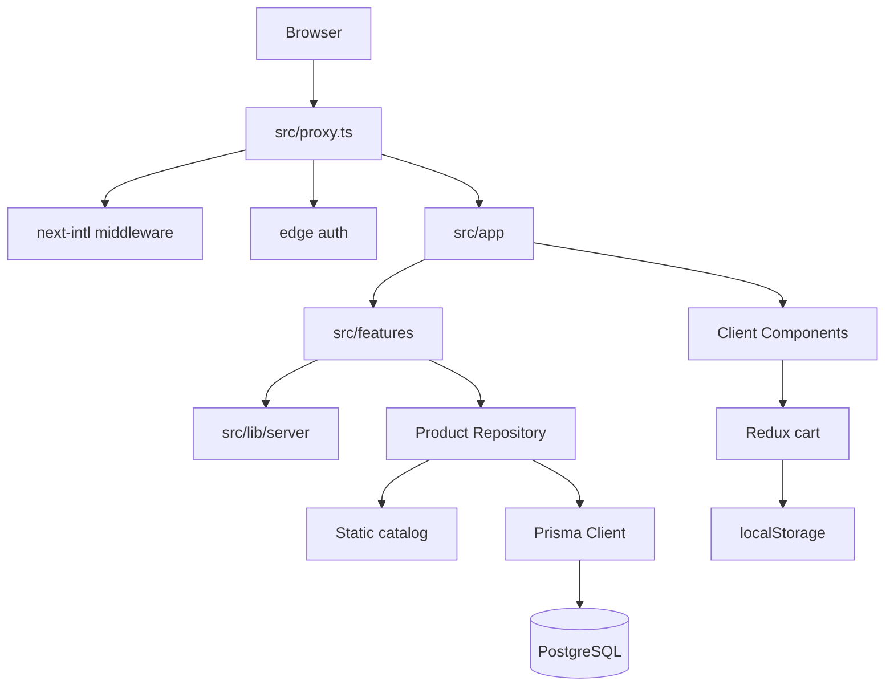

# PROJECT_ANALYSIS.md — Clothing Store

Phân tích kiến trúc và luồng dữ liệu của dự án. Cập nhật tài liệu này khi stack, routing, auth flow, cart flow hoặc product repository thay đổi.

---

## 1. Kiến trúc hiện tại

Ứng dụng là **Next.js full-stack monolith**:

- UI và routes nằm trong `src/app`.
- Domain code nằm trong `src/features`.
- Server Actions xử lý mutation.
- Prisma + PostgreSQL xử lý persistence.
- Auth.js dùng JWT session.
- next-intl xử lý locale routing.

---

## 2. Phân lớp

| Layer | Vị trí | Trách nhiệm |
|-------|--------|-------------|
| Routes | `src/app/[locale]/` | Pages, layouts, route groups |
| Features | `src/features/{auth,cart,products,home}` | UI, hooks, server logic theo domain |
| Shared UI | `src/components` | Header, footer, UI primitives |
| Cross-cutting | `src/lib` | Prisma, email, providers, metrics |
| i18n | `src/i18n`, `messages` | Locale routing và translations |
| Edge | `src/proxy.ts` | i18n middleware và auth redirects |
| Database | `prisma`, `src/generated/prisma` | Schema, seed, generated client |

---

## 3. Quyết định kiến trúc đã implement

- **Feature-first folders:** domain code colocated trong `src/features/*`.
- **Server-first rendering:** home/products pages đọc data ở server.
- **Product repository abstraction:** static và Prisma implementation được chọn bằng `PRODUCT_REPOSITORY_MODE`.
- **Hybrid cart:** Redux cho UI, localStorage cho guest, `UserServerCart` cho authenticated user.
- **Split auth config:** full Node config dùng Prisma; edge config dùng JWT-safe subset.
- **Locale-first routing:** URL người dùng luôn có `/vi` hoặc `/en`.

---

## 4. Phần chưa nối end-to-end

- Checkout, orders, payments.
- `/cart` page.
- Account/security pages.
- Admin CRUD.
- Normalized `CartItem` persistence.
- Inventory reservation.
- Global/API rate limiting.

Schema có thể đã có model cho các phần trên, nhưng app runtime chưa implement.

---

## 5. Luồng request page

Ví dụ `/vi/products?category=...`:

1. Browser gửi request tới route có locale.
2. `src/proxy.ts` chạy next-intl middleware và edge auth redirect.
3. `src/app/[locale]/layout.tsx` validate locale, set request locale và mount providers.
4. Page Server Component gọi server modules.
5. Product server layer gọi repository.
6. Repository đọc static catalog hoặc Prisma.
7. Client islands hydrate filter/cart interactions.

---

## 6. Luồng mutation cart

1. Client dispatch optimistic Redux update.
2. Server Action `addToCart` validate input bằng Zod.
3. Server đọc product/stock từ product server layer.
4. Nếu có session, server lưu vào `UserServerCart`.
5. Nếu guest, server chỉ validate và trả data; persistence nằm ở localStorage.
6. Client commit success hoặc rollback khi lỗi.

Nguyên tắc chính: server không tin price/name/image/stock từ client.

---

## 7. Luồng auth

## Credentials

1. Client submit form.
2. `loginWithCredentials` kiểm tra input và user.
3. Client gọi `signIn('credentials', { redirect: false })`.
4. Auth.js tạo JWT session.

## Registration và verification

1. `registerUser` validate bằng Zod.
2. Password được hash.
3. Verification token được generate và hash trước khi lưu.
4. Email link trỏ tới confirm page.
5. Confirm page chỉ verify sau hành động của người dùng.

## OAuth

Google/GitHub chỉ được register khi đủ env vars. Hành vi email verification của OAuth đang là policy riêng trong `auth-config.ts`.

---

## 8. Product flow

App-level product identity là slug (`prod-001`, ...).

Entry points:

- `getAllProducts`
- `getProductById`
- `getProducts`
- `getFeaturedProducts`
- `getNewArrivalsProducts`
- `checkStock`

Repository modes:

| Mode | Hành vi |
|------|---------|
| `STATIC` | Dùng catalog tĩnh |
| `PRISMA` | Dùng DB và fail fast |
| `AUTO` | Thử Prisma khi construct, fallback static nếu init lỗi |

Hiện filter chạy in-memory sau khi đọc full list.

---

## 9. Cart flow

| Loại user | State client | Persistence |
|-----------|--------------|-------------|
| Guest | Redux | localStorage |
| Authenticated | Redux optimistic | `UserServerCart` JSON |

Login sync:

1. `CartAuthSync` phát hiện session mới.
2. Guest cart được merge vào cart server hoặc cart server được hydrate về client.
3. Server dùng user ID từ session hiện tại.

---

## 10. i18n flow

- `src/i18n/routing.ts` định nghĩa `vi`, `en`, default `vi`, prefix always.
- `src/i18n/request.ts` nạp namespace messages.
- `src/i18n/navigation.ts` cung cấp Link/router locale-aware.
- Layout gọi `setRequestLocale(locale)`.

Gap hiện tại: một số string trong products page còn hardcoded tiếng Anh, và một số file vẫn dùng navigation từ Next trực tiếp.

---

## 11. Tóm tắt thiết kế database

Schema Prisma bao phủ nhiều domain:

- Auth/users/roles.
- Catalog/categories/products/variants/inventory.
- Cart.
- Orders/payments/shipments/coupons/promotions.
- Verification tokens.

Runtime hiện chủ yếu dùng auth, catalog và `UserServerCart`. Orders/payments/reservations chưa active trong app.

---

## 12. Điểm mạnh

- Feature boundaries rõ.
- Product repository abstraction giúp rollout static → Prisma.
- Auth token verification có baseline tốt.
- Cart server actions không tin dữ liệu nhạy cảm từ client.
- Locale routing được cấu hình nhất quán.
- Có unit tests cho một số logic trọng yếu.

---

## 13. Điểm yếu

- Schema rộng hơn ứng dụng runtime.
- Route constants và actual pages chưa khớp.
- Access control lists chưa được dùng nhất quán.
- Product filtering chưa scale.
- Client boundary ở home/shop còn rộng.
- Một số docs/scripts bị drift.
- Chưa có E2E/integration coverage rộng.

---

## 14. Nợ kỹ thuật chính

| ID | Nội dung | Ưu tiên |
|----|----------|---------|
| TD-01 | Quyết định scope checkout/orders | Cao |
| TD-02 | `/cart` route vs drawer | Trung bình |
| TD-03 | Thống nhất access control helpers | Cao |
| TD-04 | Validate cart JSON từ DB | Trung bình |
| TD-05 | Giảm duplicate catalog reads | Cao |
| TD-06 | Chuẩn hóa i18n navigation | Trung bình |
| TD-07 | Đưa hardcoded strings vào messages | Thấp |
| TD-08 | Observability cho repository fallback | Trung bình |
| TD-09 | Thống nhất session helper | Thấp |
| TD-10 | Bảo vệ internal metrics API | Cao |
| TD-11 | Rate limit login/register/cart | Cao |
| TD-12 | Tách client-heavy layout | Trung bình |
| TD-13 | Sửa script/doc drift | Trung bình |
| TD-14 | Backfill docs còn thiếu | Thấp |
| TD-15 | Thêm integration tests | Trung bình |
| TD-16 | Quyết định admin surface | Trung bình |

---

## 15. Tài liệu liên quan

- `AGENTS.md`
- `AI_RULES.md`
- `PROJECT_CONTEXT.md`
- `docs/planning/REFACTOR_PLAN.md`
- `docs/reviews/ARCHITECTURE_REVIEW.md`
- `docs/reviews/SECURITY_REVIEW.md`
- `docs/reviews/PERFORMANCE_REVIEW.md`
