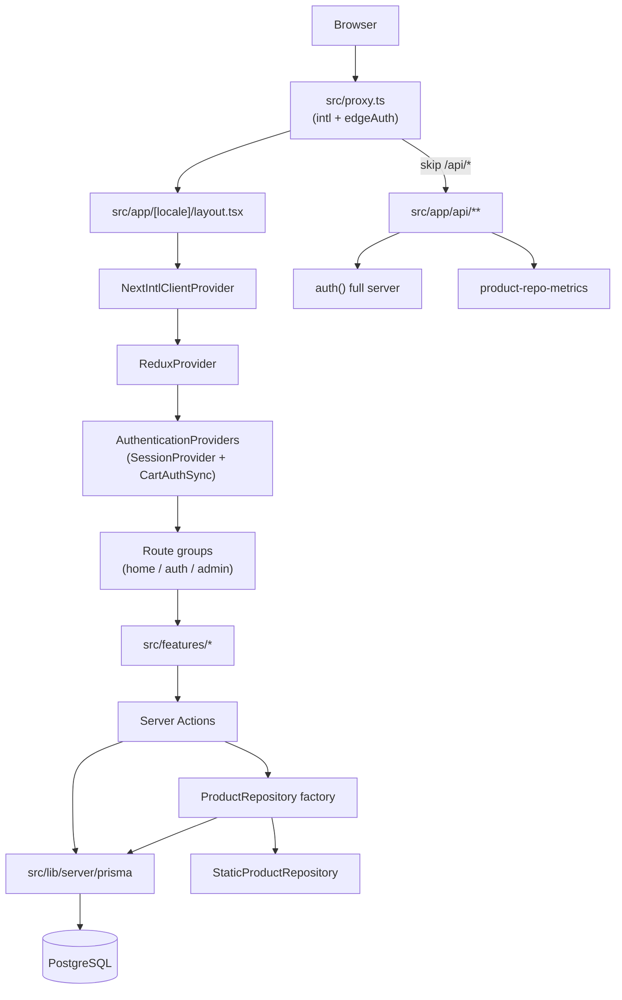

# FULL_PROJECT_REVIEW.md — Clothing Store

**Loại:** Full repository audit (documentation + static analysis)  
**Ngày:** 2026-06-03  
**Phạm vi:** `AGENTS.md`, `AI_RULES.md`, `PROJECT_CONTEXT.md`, `docs/**`, `src/` (đối chiếu findings), `prisma/`, CI config  
**Không sửa:** application source trong phiên audit gốc

**SSOT issue đang mở sau audit:** [docs/planning/OPEN_ISSUES.md](../planning/OPEN_ISSUES.md)  
**Reading index:** [docs/INDEX.md](../INDEX.md)

---

## 1. Executive Summary

Dự án là **MVP storefront** Next.js 16 với auth/cart/catalog đã có pattern server-first khá chắc: credentials dùng `verifyCredentialsLogin()` chung, rate limit IP→email, JWT re-check `User.status`, cart authenticated lấy giá/stock từ server. **Chưa sẵn sàng Production Commerce Ready** vì thiếu checkout/orders, catalog filter in-memory, và một số lỗ hổng toàn vẹn cart khi merge.

**Đánh giá readiness:**

| Level | Phù hợp? |
|-------|----------|
| MVP | **Có** |
| Staging Ready | **Gần** (sau P0 + lint) |
| Production Ready | **Chưa** (CI lint, cart merge, observability) |
| Production Commerce Ready | **Không** (checkout, orders, inventory flow, catalog scale) |

**Top 3 rủi ro (VERIFIED):**

1. **`mergeCart` / `mergeCartsLogic` không gọi `checkStock`** — có thể persist quantity vượt tồn kho hoặc dựa snapshot `stock` cũ trong JSON.
2. **`UserServerCart.items` parse bằng cast** — không validate schema khi đọc DB.
3. **CI lint FAIL** — merge branch sẽ fail pipeline dù test/typecheck pass.

---

## 2. Quick Scorecard

| Domain   | Score (1-5) | Notes |
| -------- | ----------- | ----- |
| Auth     | 4           | Shared credentials flow, rate limit, JWT invalidation, hashed verification tokens |
| Cart     | 3           | Server-derived price/name tốt; merge + JSON read còn gap |
| Products | 3           | Repository pattern ổn; filter full-list in-memory |
| Routing  | 3           | Proxy + locale layout ổn; nhiều route constant chưa có page |
| API      | 4           | Metrics route có session + role; `/api/*` bypass proxy (by design) |
| Prisma   | 3           | Schema lớn; runtime chỉ dùng subset model |
| i18n     | 3           | next-intl layout OK; vài hook/link lệch `@/i18n/navigation` |
| Tests    | 4           | 96 tests pass; thiếu E2E/component/API integration |
| Docs     | 3           | AGENTS khớp khá tốt; scripts drift; doc duplication (đã xử lý SSOT sau audit) |

---

## 3. Topology (VERIFIED)

---

## 4. Findings

Sắp xếp Critical → High → Medium → Low. Mỗi finding ghi **Status: VERIFIED** trừ khi ghi ASSUMPTION.

Các issue đang mở được quản lý tại `docs/planning/OPEN_ISSUES.md` (ID `OI-*`).

---

### mergeCart không xác thực tồn kho sau merge

**Severity:** High  
**Status:** VERIFIED  
**Open Issue:** OI-001  
**File Path:** `src/features/cart/server/actions.ts`, `src/features/cart/server/utils.ts`

**Description:** `mergeCart` re-resolve giá/tên/ảnh từ server nhưng không gọi `checkStock`. `mergeCartsLogic` giới hạn quantity bằng `userItem.stock` (snapshot JSON) hoặc giữ nguyên `guestItem.quantity` cho item guest mới.

**Evidence:** `mergeCartsLogic` dùng `Math.min(..., userItem.stock)`; nhánh guest mới không cap bởi server stock; `mergeCart` không gọi `checkStock` sau merge.

**Impact:** User đăng nhập có thể persist cart vượt inventory thực tế.

**Recommendation:** Sau merge, với từng item gọi `checkStock(productId, quantity)`; cập nhật hoặc loại item không đủ stock.

**Related References:** RF-201, PERF-15

---

### UserServerCart JSON đọc không qua Zod

**Severity:** Medium  
**Status:** VERIFIED  
**Open Issue:** OI-002  
**File Path:** `src/features/cart/server/db.ts`

**Description:** `parseCartItems` cast `unknown` → `CartItem[]` không validate shape.

**Evidence:** `return value as CartItem[]` sau `Array.isArray` check.

**Impact:** JSON hỏng/tay đổi gây lỗi runtime hoặc logic cart sai.

**Recommendation:** Zod schema mirror `CartItem` khi read/write.

**Related References:** RF-201

---

### CI lint fail (`pnpm lint`)

**Severity:** Medium  
**Status:** VERIFIED  
**Open Issue:** OI-003  
**File Path:** `src/features/auth/server/auth-config.test.ts`, `src/features/auth/server/auth-config.ts`

**Description:** `pnpm lint` exit 1; `no-explicit-any` trong test; unused `trigger` trong JWT callback.

**Impact:** CI pipeline fail.

**Recommendation:** Thay `any` bằng type cụ thể; dọn `trigger`.

---

### Protected `/cart` không có page

**Severity:** Medium  
**Status:** VERIFIED  
**Open Issue:** OI-004  
**File Path:** `src/features/auth/config/access.ts`, `src/app/**`

**Description:** `PROTECTED_ROUTES` gồm `/cart` nhưng không có `page.tsx` tương ứng.

**Impact:** User verified có thể 404; proxy vẫn enforce login.

**Recommendation:** Thêm page hoặc bỏ khỏi `PROTECTED_ROUTES`.

**Related References:** AR-04, RF-206

---

### Redirect sau auth có thể mất locale prefix

**Severity:** Medium  
**Status:** VERIFIED  
**Open Issue:** OI-005  
**File Path:** `src/features/auth/hooks/useAuthRedirect.ts`

**Description:** `useRouter` từ `next/navigation` thay vì `@/i18n/navigation`.

**Impact:** `router.push('/dashboard')` có thể thiếu prefix `vi`/`en`.

**Recommendation:** Chuyển sang `@/i18n/navigation`.

**Related References:** AR-08, RF-207

---

### Mọi `/api/*` bypass proxy auth

**Severity:** Low (accepted architecture)  
**Status:** VERIFIED  
**Open Issue:** OI-006  
**File Path:** `src/proxy.ts`, `src/app/api/**`

**Description:** API phải tự auth — rủi ro quên khi thêm route.

**Recommendation:** Checklist/template cho API route mới.

**Related References:** RF-004, SEC-02 (proxy note)

---

### Link/navigation lệch chuẩn i18n

**Severity:** Medium  
**Status:** VERIFIED  
**Open Issue:** OI-007  
**File Path:** `LoginForm.tsx`, `Footer.tsx`, `useProductFilters.ts`, `useLogin.ts`, `useAuthError.ts`, `social-auth.ts`

**Description:** Dùng `next/link` hoặc `next/navigation` thay vì `@/i18n/navigation`.

**Recommendation:** Thống nhất i18n navigation.

**Related References:** AR-08, RF-207

---

### Catalog filter sau full-list read

**Severity:** Medium  
**Status:** VERIFIED  
**Open Issue:** OI-008  
**File Path:** `src/features/products/server/products.ts`, `data.ts`

**Description:** `getAllProducts()` rồi filter in-memory.

**Impact:** Scale kém khi catalog lớn.

**Recommendation:** Đẩy filter xuống repository/Prisma.

**Related References:** AR-06, RF-003, RF-108, RF-222, PERF-10, PERF-20

---

### package.json scripts trỏ file không tồn tại

**Severity:** Medium  
**Status:** VERIFIED  
**Open Issue:** OI-009  
**File Path:** `package.json`, `scripts/` (empty)

**Description:** `audit:products`, `smoke:products*` không có file.

**Recommendation:** Thêm scripts hoặc xóa khỏi package.json + cập nhật docs.

**Related References:** AR-11, RF-212

---

### AuthLogger ghi email (PII) ra console

**Severity:** Low  
**Status:** VERIFIED  
**Open Issue:** OI-010  
**File Path:** `auth-logger.ts`, `useLogin.ts`

**Description:** Log context có `email`.

**Recommendation:** Redact trong production.

**Related References:** RF-306

---

### validateCallbackUrl protocol-relative path

**Severity:** Medium (nếu reproduce)  
**Status:** ASSUMPTION  
**Open Issue:** *(không đưa vào OPEN_ISSUES)*  
**File Path:** `src/features/auth/lib/callback-url.ts`

**Description:** Chưa reproduce đủ trên mọi runtime.

**Recommendation:** Reject pathname bắt đầu `//`.

---

## 5. Strengths (VERIFIED)

| Điểm mạnh | File path |
|-----------|-----------|
| Shared credentials + rate limit IP→email | `credentials-login.ts` |
| Auth.js `authorize` dùng `verifyCredentialsLogin` | `auth-config.ts` |
| JWT invalidate non-ACTIVE user | `auth-config.ts` |
| Verification token SHA-256 + timing-safe compare | `verification/token.ts` |
| `addToCart` ignore client price/name | `cart/server/actions.ts` |
| Metrics API: 401/403 + role | `api/internal/.../route.ts` |
| Admin layout server-side role guard | `(admin)/layout.tsx` |
| Auth redirect same-origin | `auth-config.ts` `redirect` |
| Vitest 96 tests pass | `**/*.test.ts` |

---

## 6. Known Gaps / Out of Scope

- Checkout, orders UI, payment/shipment flows  
- Inventory reservation (`ReservedStock` schema only)  
- Global/API rate limiting (ngoài auth buckets)  
- `/cart` page, `/account/*`, admin CRUD, legal pages  
- Prisma models `Order`, `CartItem`, … chưa wired runtime  

---

## 7. Open Questions

1. OAuth auto-set `emailVerified` — policy có chủ đích? (`auth-config.ts`)  
2. `SUPER_ADMIN` redirect `/admin` — có page?  
3. Guest cart stock hoàn toàn client-side đến checkout?  
4. `REPO_METRICS_ENABLED` trong production?  

*(Auth-specific SEC-01–SEC-04 vẫn theo dõi tại `SECURITY_REVIEW.md`, không duplicate trong OI list.)*

---

## 8. Recommended Roadmap (snapshot)

Đã materialize thành:

- [docs/planning/OPEN_ISSUES.md](../planning/OPEN_ISSUES.md)
- [docs/planning/ROADMAP.md](../planning/ROADMAP.md)

**P0:** OI-001, OI-002, OI-003  
**P1:** OI-004 … OI-007  
**P2:** OI-008 … OI-010  

---

## 9. Coverage Audit

| Metric | Value |
|--------|-------|
| Files In Scope | ~220 (ts/tsx trong `src`, `prisma`, `messages`, CI) |
| Files Read (trực tiếp) | ~70 |
| Coverage % | ~32% toàn file; ~88% high-risk paths |
| Unread Groups | `components/ui/**`, `home/**`, full `messages/**`, nhiều migration SQL, auth page TSX chi tiết |

---

## 10. Commands Executed

| Command | Result | Notes |
|---------|--------|-------|
| `pnpm lint` | **FAIL** | `auth-config.test.ts`: `no-explicit-any`; `auth-config.ts`: unused `trigger` |
| `pnpm typecheck` | **PASS** | `tsc --noEmit` |
| `pnpm test` | **PASS** | 21 files, 96 tests |

---

## 11. Documentation Follow-up (post-audit)

Sau audit, hệ thống docs được tối ưu:

- `docs/INDEX.md` — entry point AI  
- `OPEN_ISSUES.md` — SSOT open work  
- Stub `docs/**/AGENTS.md`, `reviews/PROJECT_ANALYSIS.md` — removed  
- `PROJECT_CONTEXT.md`, `docs/README.md` — link SSOT, không duplicate issue lists  

---

*Historical record — không cập nhật finding status tại đây; cập nhật tại `OPEN_ISSUES.md`.*
